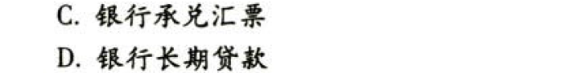
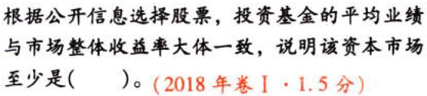

C01财务管理基本原理

# 1. 题目

【答案】
[查看解析和答案](media/c73b0161bae83e75b288a5cb01b55ff2.png.md)
# 2. 题目

【答案】
[查看解析和答案](media/e97394aefa7c9b53315811a9ebd9a7b3.png.md)
# 3. 题目

【答案】
[查看解析和答案](media/92484e890592a4ba389477547e8a1793.png.md)
# 4. 题目

【答案】
[查看解析和答案](media/3032c7485c0a4a84b5ce029b64b1999d.png.md)
# 5. 题目

【答案】
[查看解析和答案](media/b83f15778a5eafe410aa830e8a3985a7.png.md)
# 6. 题目

【答案】
[查看解析和答案](media/e65e1cbc2591043ced58d0234e1e75e6.png.md)
# 7. 题目

【答案】
[查看解析和答案](media/2c4f68f43c8f608d2382003df727a033.png.md)
# 8. 题目

【答案】
[查看解析和答案](media/ed2d029ff24dd099668e517bfd6f51d3.png.md)

