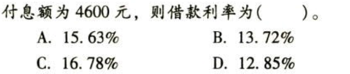

C03价值评估基础

# 1. 题目

【答案】
[查看解析和答案](media/33eadc578c1e7d8b36fc230096578188.png.md)
# 2. 题目

【答案】
[查看解析和答案](media/c08e46320afd011453651b2318d9dbc8.png.md)
# 3. 题目

【答案】
[查看解析和答案](media/4cfad937ea2738bb136cfa8c49ff93ff.png.md)
# 4. 题目

【答案】
[查看解析和答案](media/7edcd998921e3de41787b06f74f27923.png.md)
# 5. 题目

【答案】
[查看解析和答案](media/42a8ed336e1bf71b97caddb8500d57ba.png.md)
# 6. 题目

【答案】
[查看解析和答案](media/2e5ae06365814e0ad69198c4bacd4394.png.md)
# 7. 题目

【答案】
[查看解析和答案](media/ee2fc87485656670a5347c5aae4bd8c1.png.md)
# 8. 题目

【答案】
[查看解析和答案](media/1ce0207800c12380a28993acdb61433b.png.md)
# 9. 题目

【答案】
[查看解析和答案](media/55bafb61682e0cc3dd36b9834aaf1ce8.png.md)
# 10. 题目

【答案】
[查看解析和答案](media/d9e6bd1933fd7edcccba9f1ece3948ce.png.md)
# 11. 题目

【答案】
[查看解析和答案](media/e9e370436a3f146bf0202f93c1a90940.png.md)
# 12. 题目

【答案】
[查看解析和答案](media/d22ac7c78c1f1cc377f9c745a6acc769.png.md)
# 13. 题目

【答案】
[查看解析和答案](media/78db8827c96e0aaf48e1a28c202dc3a0.png.md)
# 14. 题目

【答案】
[查看解析和答案](media/532cfd656f41df0aa221562bca013cea.png.md)
# 15. 题目

【答案】
[查看解析和答案](media/a002fd59882a557311e064acf8e91dce.png.md)
# 16. 题目

【答案】
[查看解析和答案](media/9ec3702951df8b89a4f43b627a3c4f6a.png.md)

