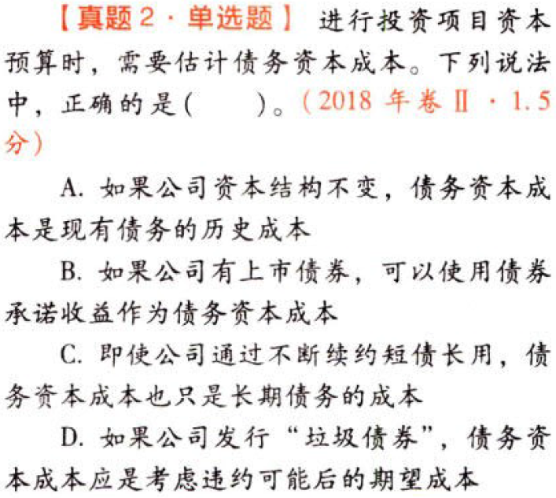
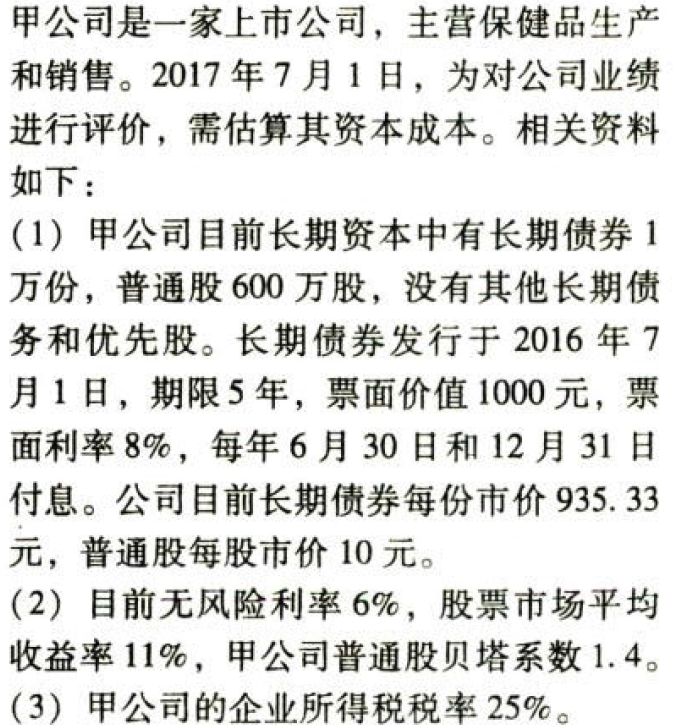

C04资本成本

# 1. 题目

【答案】
[查看解析和答案](media/9236ac50acb16f4ba7c54ad0f993d2e5.png.md)
# 2. 题目

【答案】
[查看解析和答案](media/639e4bf1f1ffe5c9be0b7f5bf5627368.png.md)
# 3. 题目

【答案】
[查看解析和答案](media/04c76103b1d384b86299062c325a8645.png.md)
# 4. 题目

【答案】
[查看解析和答案](media/3c8716282c0ee03654dd555b9458fb71.png.md)
# 5. 题目

【答案】
[查看解析和答案](media/6cc6b9ec141bae7ff795adcdf3f3e8c8.png.md)
# 6. 题目

【答案】
[查看解析和答案](media/4b0401aaa118b4b2c2ddca85410651ac.png.md)
# 7. 题目

【答案】
[查看解析和答案](media/1333de1bd46267a9b6421e84a03d6249.png.md)
# 8. 题目

【答案】
[查看解析和答案](media/96dee5e3a9e491266aef5b3fa866ca2e.png.md)
# 9. 题目

【答案】
[查看解析和答案](media/6feddebfa0448c0409694e560eedebea.png.md)
# 10. 题目

【答案】
[查看解析和答案](media/d6c4348ec4c949393c2c0267ea50c5b6.png.md)
# 11. 题目

【答案】
[查看解析和答案](media/5c0d95b61f287adf16cae4c6da8c43ad.png.md)
# 12. 题目

【答案】
[查看解析和答案](media/491425ed59933cd687fb14bdd6bc0399.png.md)
# 13. 题目

【答案】
[查看解析和答案](media/9609d9d226271239094cfb10bcf9af21.png.md)
# 14. 题目

【答案】
[查看解析和答案](media/eb5b7711f91dc899794d591db0cafba3.png.md)
# 15. 题目

【答案】
[查看解析和答案](media/be10f89027e44ec880f0e93e78e22c51.png.md)

