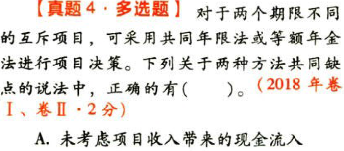
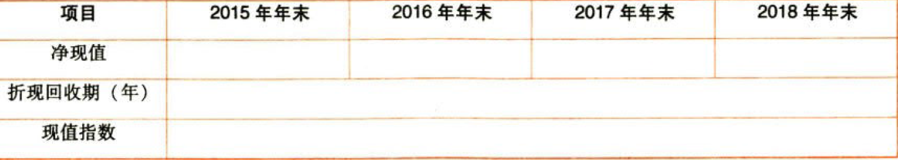

投资项目资本预算

# 1. 题目

【答案】
[查看解析和答案](media/34c19e2257d8afadd192b2c29d119522.png.md)
# 2. 题目

【答案】
[查看解析和答案](media/dced50f346bac7e2981828264d60868b.png.md)
# 3. 题目

【答案】
[查看解析和答案](media/9d12d70b6591f95a66ac7dae2772aec2.png.md)
# 4. 题目

【答案】
[查看解析和答案](media/c72a19f4ff44b187386b0b96384df8f3.png.md)
# 5. 题目

【答案】
[查看解析和答案](media/f26b999a200762286f1f9d48900034bf.png.md)
# 6. 题目

【答案】
[查看解析和答案](media/7663144315228e7cfda0db729c92492a.png.md)
# 7. 题目

【答案】
[查看解析和答案](media/b7f2a622f6796b16f190081c50cfaef7.png.md)
# 8. 题目

【答案】
[查看解析和答案](media/691c90a30f4faeed6bfe1cd9ca56a500.png.md)
# 9. 题目

【答案】
[查看解析和答案](media/061b750e5c43be3b816f49e977692999.png.md)
# 10. 题目

【答案】
[查看解析和答案](media/ff03cb077ba6a2c2e66319eb1df1fb8f.png.md)
# 11. 题目

【答案】
[查看解析和答案](media/12713ed99470c313ac94d75660886da0.png.md)
# 12. 题目

【答案】
[查看解析和答案](media/79f3689b7934f375a6e686fbe37d1f1e.png.md)

