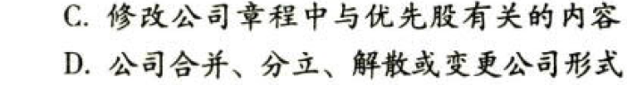

C06债券、股票价值评估

# 1. 题目

【答案】
[查看解析和答案](media/579a9190b2a76b44b7c00192b0748298.png.md)
# 2. 题目

【答案】
[查看解析和答案](media/e1cc0595918dc060a5cfcf2e661cc16f.png.md)
# 3. 题目

【答案】
[查看解析和答案](media/5b1da256d1e036f73170b9b4c307a478.png.md)
# 4. 题目

【答案】
[查看解析和答案](media/f181828d910c03e401bfd792d8d17981.png.md)
# 5. 题目

【答案】
[查看解析和答案](media/bbf647b45374a1a490cbb34e7ce8fb58.png.md)
# 6. 题目

【答案】
[查看解析和答案](media/4838969c91071b9dd9ae83bbe4cacfbf.png.md)
# 7. 题目

【答案】
[查看解析和答案](media/72cad8a2e763342d7a98fd2a7ceb4cdc.png.md)
# 8. 题目

【答案】
[查看解析和答案](media/b9642da0d2a8a1d453360f3c587bf9e9.png.md)
# 9. 题目

【答案】
[查看解析和答案](media/cb341cc8cd1e72c78cb3fd95fd787b1e.png.md)

