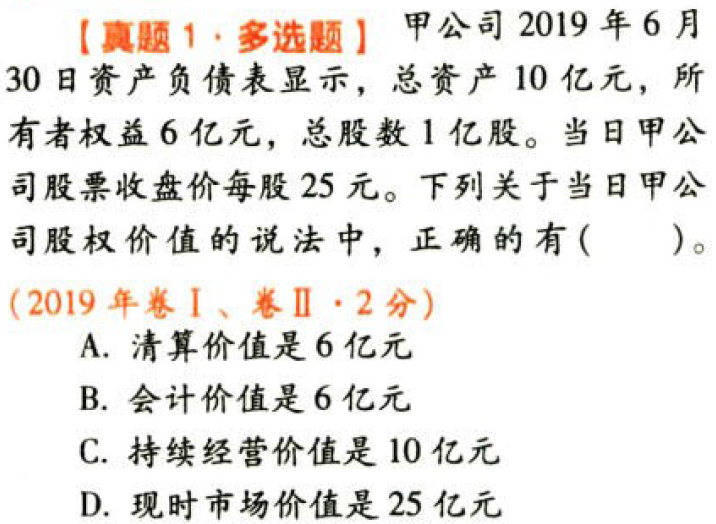
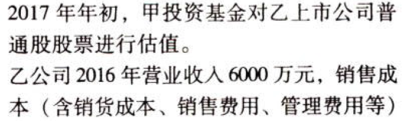

C08企业价值评估

# 1. 题目

【答案】
[查看解析和答案](media/c5da21e873de07aab96cf7394ca900a5.png.md)
# 2. 题目

【答案】
[查看解析和答案](media/1f8eff66382a5e95e53344b7234ea034.png.md)
# 3. 题目

【答案】
[查看解析和答案](media/141b8f5d0a83262c6af3c0b6ceebb420.png.md)
# 4. 题目

【答案】
[查看解析和答案](media/1921b63e667436cb3879d74f510a77de.png.md)
# 5. 题目

【答案】
[查看解析和答案](media/8a09b7e542cf7d306cf84adc0705031b.png.md)
# 6. 题目

【答案】
[查看解析和答案](media/676c8bf389dd63c5b65cd7de09e7ff4a.png.md)
# 7. 题目

【答案】
[查看解析和答案](media/4e10f50bfb03d6f2c50ed43c4d1e67a3.png.md)
# 8. 题目

【答案】
[查看解析和答案](media/7736a6cbbb43b7361d839230c9175937.png.md)
# 9. 题目

【答案】
[查看解析和答案](media/7e1185eeac3161e926a0d8fc2fbf3ca5.png.md)
# 10. 题目

【答案】
[查看解析和答案](media/8155ac68e00864f48804a37ad3267211.png.md)
# 11. 题目

【答案】
[查看解析和答案](media/d24105672eb95c5166141a6cbd6ebb78.png.md)
# 12. 题目

【答案】
[查看解析和答案](media/0ae6758a50bef8854bf2d62e77b18ab2.png.md)

