C09资本结构

# 1. 题目

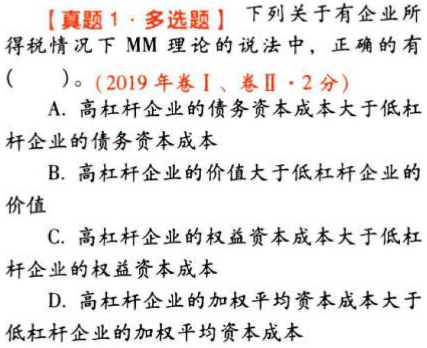

【答案】
[查看解析和答案](media/8851a8c61ab974600db12d39469e78f3.png.md)
# 2. 题目

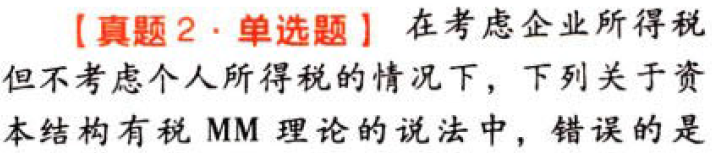

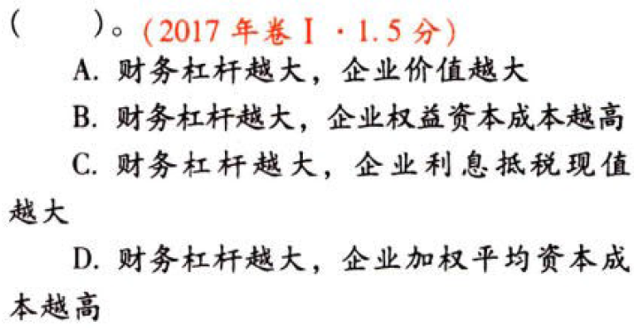

【答案】
[查看解析和答案](media/dd40b38be14983f99f3bef0346d6344e.png.md)
# 3. 题目

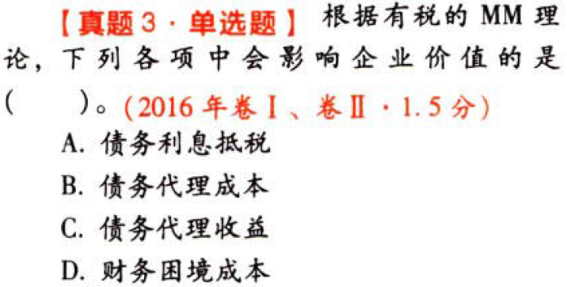

【答案】
[查看解析和答案](media/2929cdb432be4269b272254b8d65ca41.png.md)
# 4. 题目

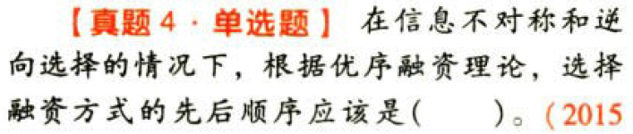

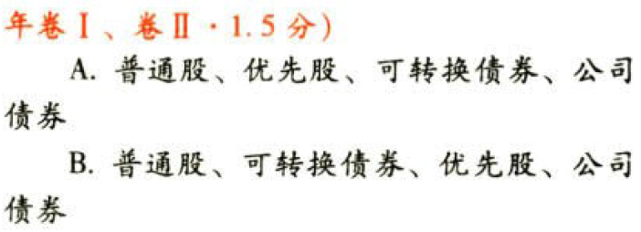

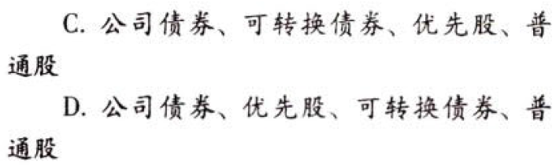

【答案】
[查看解析和答案](media/ba082ec0be6c06c21d4b0e321ce38caa.png.md)
# 5. 题目

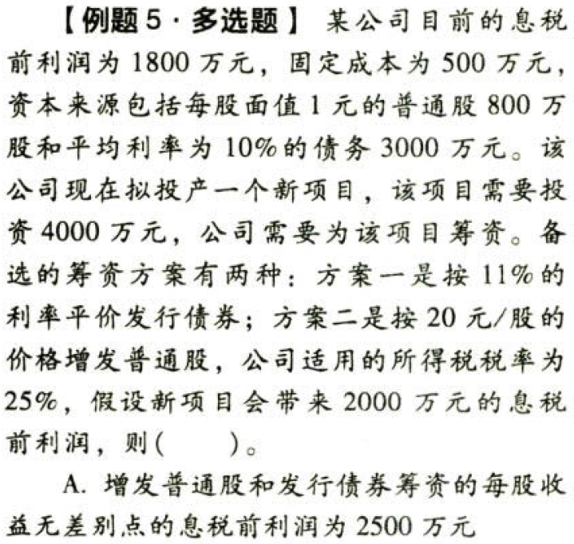

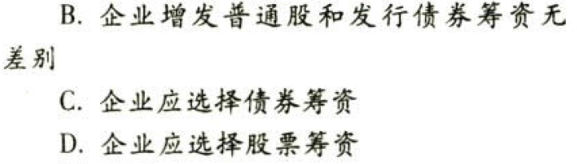

【答案】
[查看解析和答案](media/356e12f50e652e188b18826aafb3eb51.png.md)
# 6. 题目

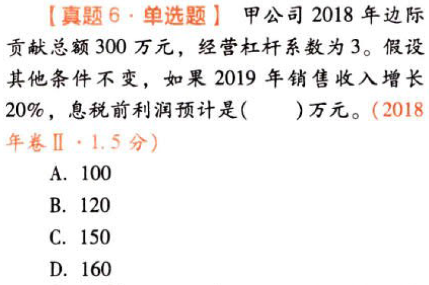

【答案】
[查看解析和答案](media/67081027480ff3425ee995cc6a4d3b3c.png.md)
# 7. 题目

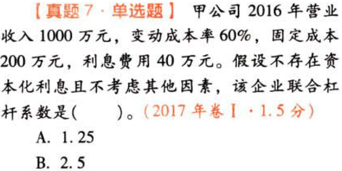

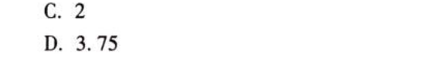

【答案】
[查看解析和答案](media/eb9c0ab9f8a4bc8844034c6073b4fa75.png.md)
# 8. 题目

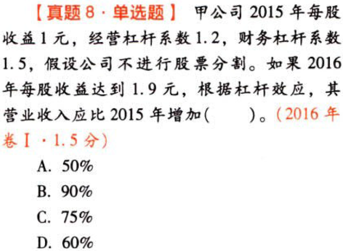

【答案】
[查看解析和答案](media/25172d07310e44de77368796bd599b43.png.md)
# 9. 题目

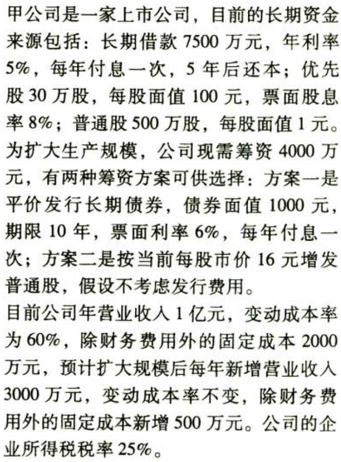

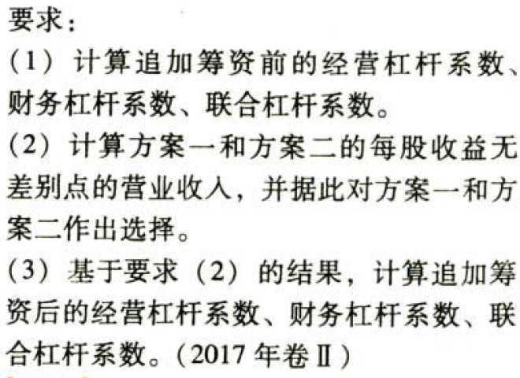

【答案】
[查看解析和答案](media/088c58266c8ce905b7dc665bccaf86ff.png.md)

