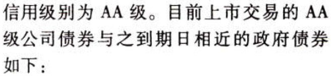

C10长期筹资

# 1. 题目

【答案】
[查看解析和答案](media/ecbdaac171324b27fb926cb9e5c2be54.png.md)
# 2. 题目

【答案】
[查看解析和答案](media/35784e98315e030491e336972fc6abf0.png.md)
# 3. 题目

【答案】
[查看解析和答案](media/0dd0d5f626f819916f6c289bff1fd595.png.md)
# 4. 题目

【答案】
[查看解析和答案](media/24624dd1e22d9d02bc163400d3f0727e.png.md)
# 5. 题目

【答案】
[查看解析和答案](media/07f4ecf728ce2d33f7e5b1080dd33f3d.png.md)
# 6. 题目

【答案】
[查看解析和答案](media/04717a43a7795ebe0b9a5deac6ca3990.png.md)
# 7. 题目

【答案】
[查看解析和答案](media/527d2532eab8c11c9436fb17ccfb3c7d.png.md)
# 8. 题目

【答案】
[查看解析和答案](media/f3f05c2a923fc5ce25ad947122398d5d.png.md)
# 9. 题目

【答案】
[查看解析和答案](media/35cc0e641e8b3fa30178a8ac974260ac.png.md)
# 10. 题目

【答案】
[查看解析和答案](media/734d896ce7b21e25715e25f4453fb654.png.md)
# 11. 题目

【答案】
[查看解析和答案](media/02f62fb691bf8b12531f212ad079cf0b.png.md)
# 12. 题目

【答案】
[查看解析和答案](media/364a01600eaf5916187190abb0e93237.png.md)
# 13. 题目

【答案】
[查看解析和答案](media/5420eae79f662b906c2d3e5c8f739fd9.png.md)
# 14. 题目

【答案】
[查看解析和答案](media/7bfa7ba6ee4c18900eba4f33b2050da8.png.md)

