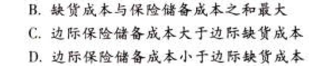

C12营运资本管理

# 1. 题目

【答案】
[查看解析和答案](media/eb9e8af35aabf00d98ea84436207eea5.png.md)
# 2. 题目

【答案】
[查看解析和答案](media/e93a028866f82f213c663784a41835a3.png.md)
# 3. 题目

【答案】
[查看解析和答案](media/7e0949922df6b2dcc512ec92fc530c84.png.md)
# 4. 题目

【答案】
[查看解析和答案](media/fe2625926875902945572e6590cc2d11.png.md)
# 5. 题目

【答案】
[查看解析和答案](media/2611bcf04203c7fa7a23e9e6c349c81c.png.md)
# 6. 题目

【答案】
[查看解析和答案](media/32a0f67916f9e7a7e8d62be0b780f058.png.md)
# 7. 题目

【答案】
[查看解析和答案](media/0f3f873b6b603ec84cb587e805e6dea7.png.md)
# 8. 题目

【答案】
[查看解析和答案](media/4bf81d013227d2018ff6c65db877d094.png.md)
# 9. 题目

【答案】
[查看解析和答案](media/f798115c7f1987881ca87441cf4763e5.png.md)
# 10. 题目

【答案】
[查看解析和答案](media/6ce583db7a22eb05139ef00d989be97e.png.md)
# 11. 题目

【答案】
[查看解析和答案](media/70f23ed1efc3173a5326489b6fbcdf1a.png.md)
# 12. 题目

【答案】
[查看解析和答案](media/8d817d3f49d2df485fedb4906e1f1461.png.md)
# 13. 题目

【答案】
[查看解析和答案](media/9b15904fa0df4e06a4c3cdce852ad77a.png.md)
# 14. 题目

【答案】
[查看解析和答案](media/102be8c961a4a66144d0f1a9776ad52c.png.md)
# 15. 题目

【答案】
[查看解析和答案](media/aad0bebd7d9dc179c489b69beba66aac.png.md)

