C13产品成本计算

# 1. 题目

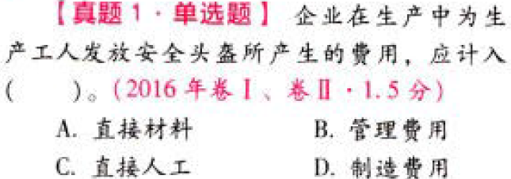

【答案】
[查看解析和答案](media/44634b243be45116dd6a3853967a62e5.png.md)
# 2. 题目

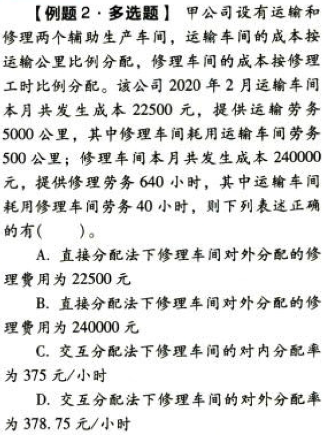

【答案】
[查看解析和答案](media/c4b9d92cd0a0c8e14a2b73a734e7f64b.png.md)
# 3. 题目

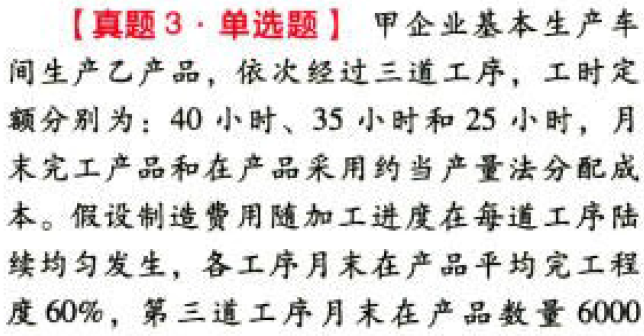

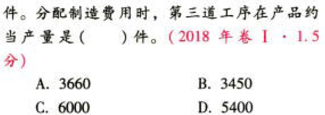

【答案】
[查看解析和答案](media/3b4f5f0fdc4ba24f456c8e62faa44ac9.png.md)
# 4. 题目

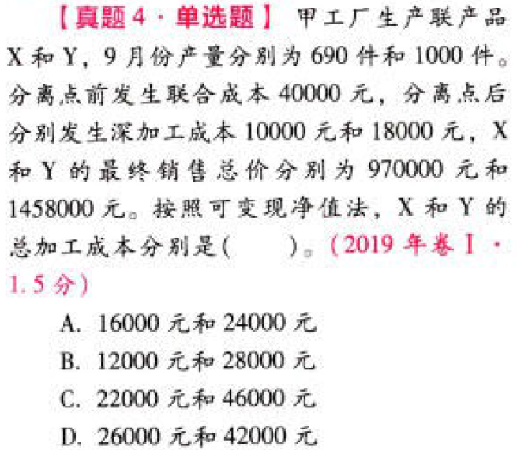

【答案】
[查看解析和答案](media/7960cd00f5d7b8789242d8104396d7bc.png.md)
# 5. 题目

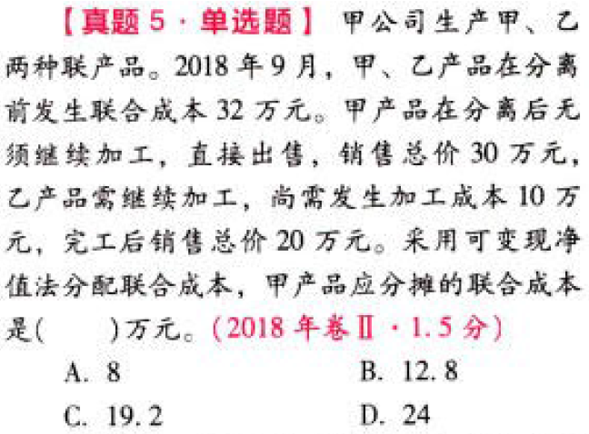

【答案】
[查看解析和答案](media/e3570cb5c5df8aef6b30a6f9c7c05a01.png.md)
# 6. 题目

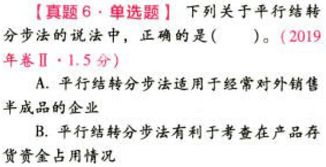

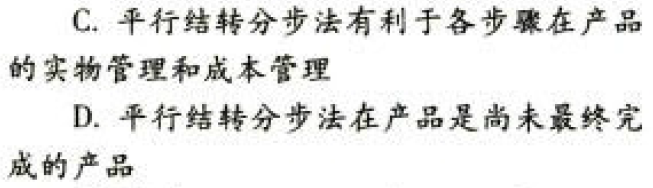

【答案】
[查看解析和答案](media/01a1c6fe6fb8bf631b05604081d060cf.png.md)
# 7. 题目

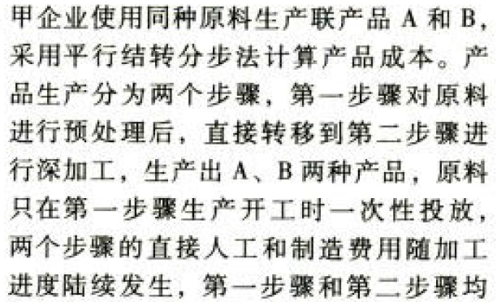

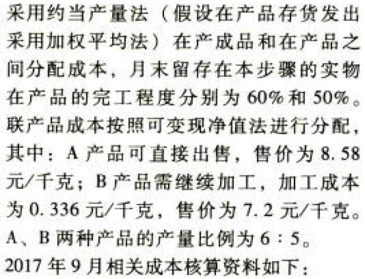

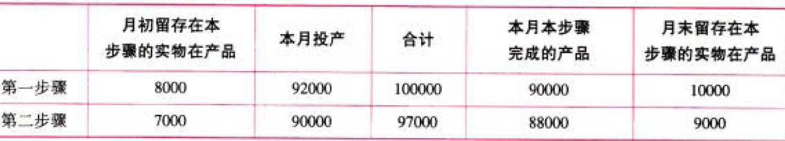

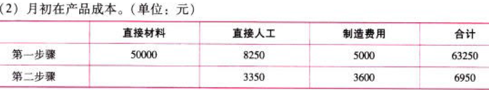

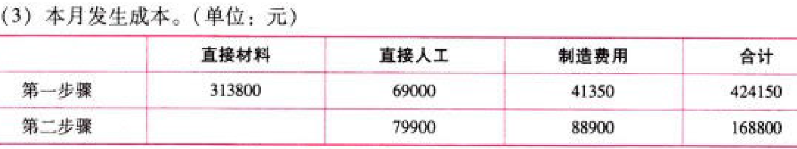

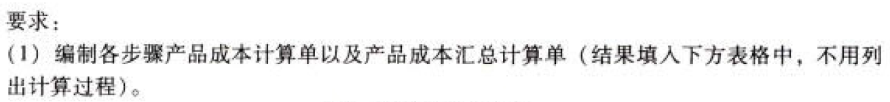

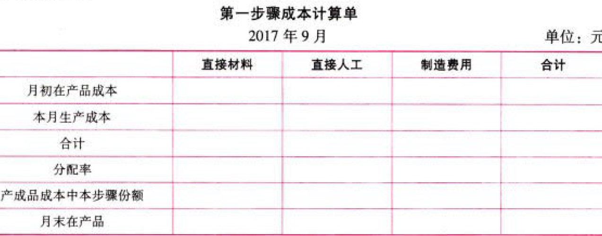

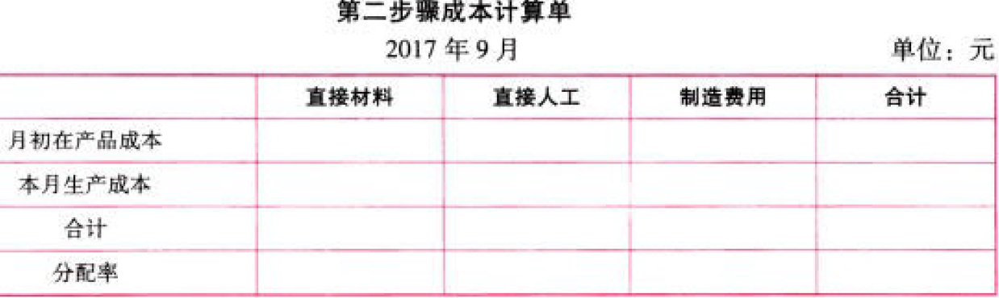

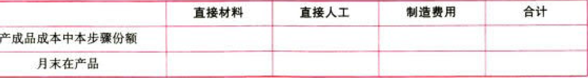

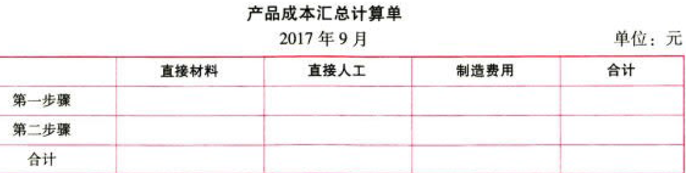

【答案】
[查看解析和答案](media/07bcfee8475a99f5f9cbb5fc64f6636e.png.md)
# 8. 题目

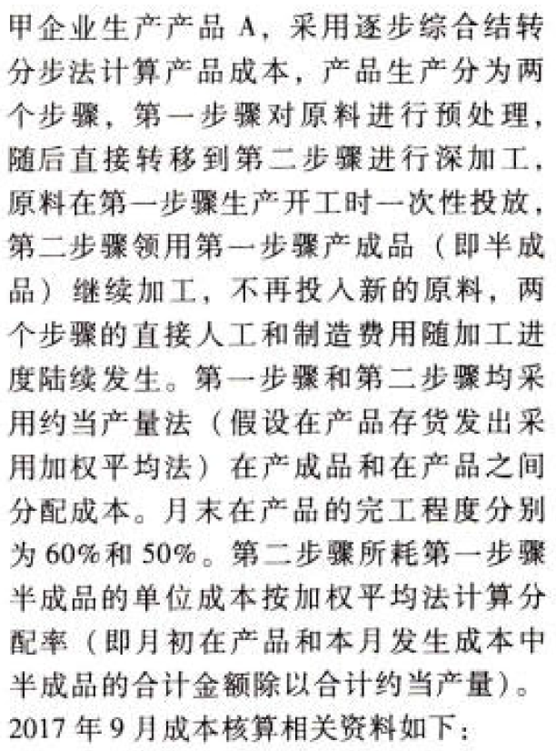

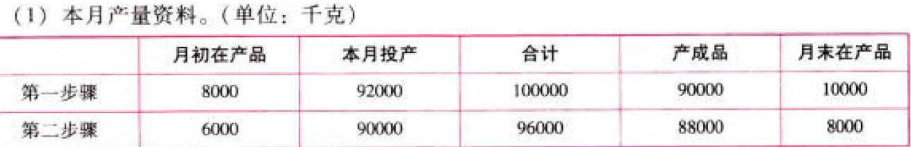

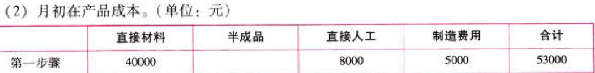

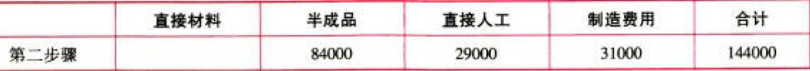

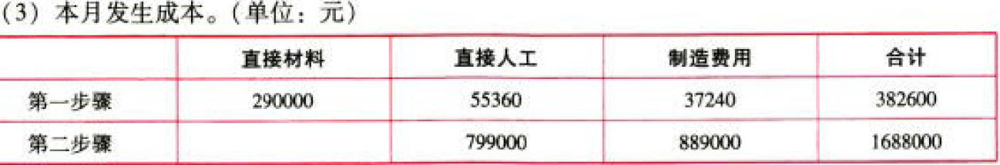

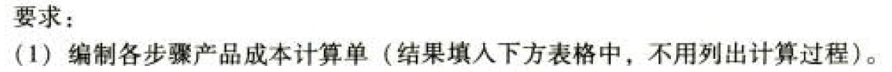

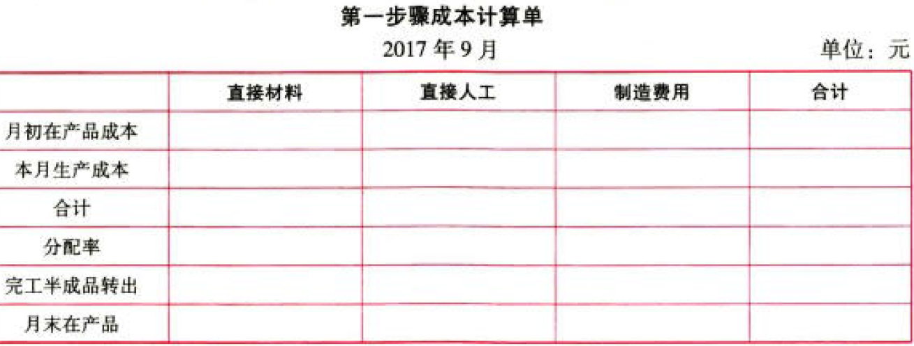

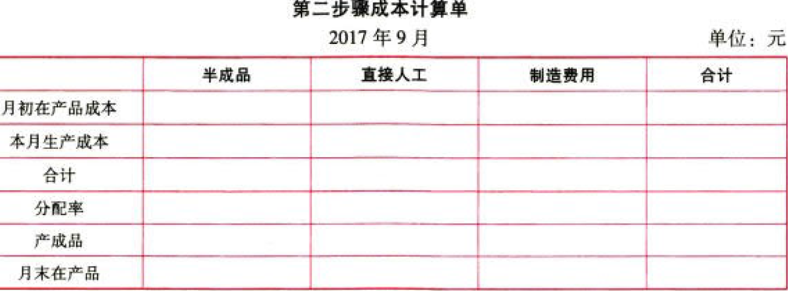

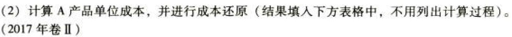

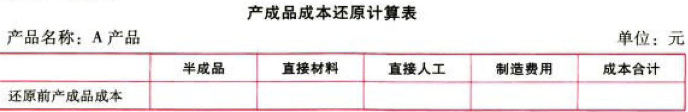

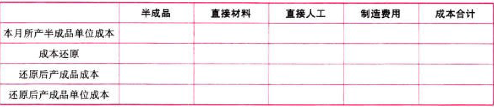

【答案】
[查看解析和答案](media/38d960a33596f4fb08b4f57df0dfe768.png.md)
# 9. 题目

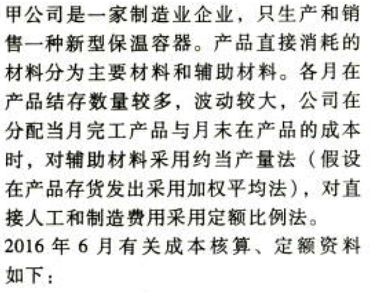

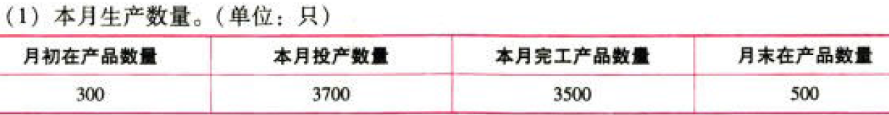

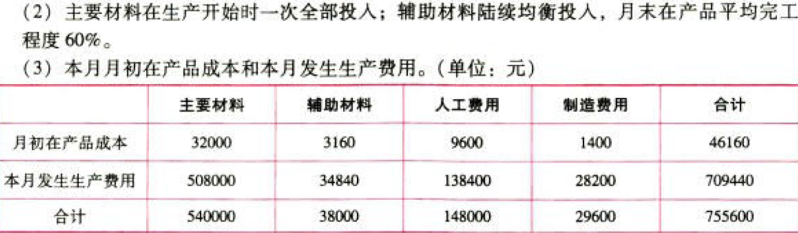

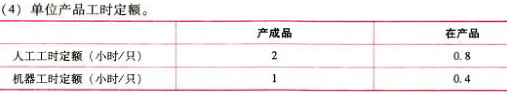

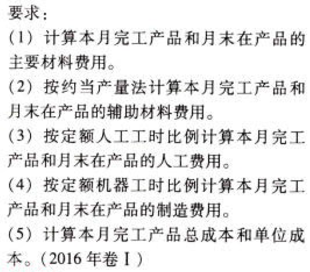

【答案】
[查看解析和答案](media/3460cf72f8ff6ac37af081e7e9e0e21e.png.md)

