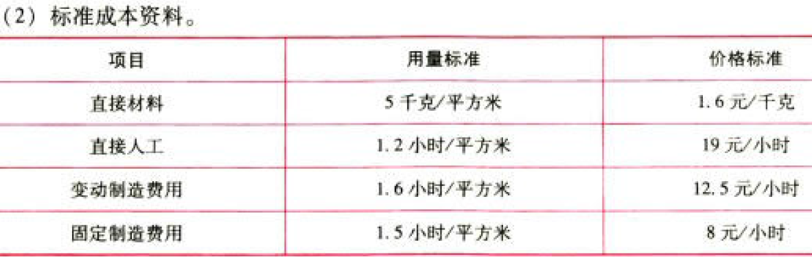

C14标准成本法

# 1. 题目

【答案】
[查看解析和答案](media/8af96247fb580d0bfa66299098cc2637.png.md)
# 2. 题目

【答案】
[查看解析和答案](media/df2c9ccdc90ba6cb0ce4b5ae0b478e7a.png.md)
# 3. 题目

【答案】
[查看解析和答案](media/54f48d94580b016a9f4fe466915b0a39.png.md)
# 4. 题目

【答案】
[查看解析和答案](media/7c155f05dc37c6fc3cbbed54ce4d2834.png.md)
# 5. 题目

【答案】
[查看解析和答案](media/3e2ca6e1a4c8804890b416212c17c40c.png.md)
# 6. 题目

【答案】
[查看解析和答案](media/5b2ce302de921490fcce63e10823adf5.png.md)
# 7. 题目

【答案】
[查看解析和答案](media/6b96ba32090d699fe58cbf94fbe93456.png.md)
# 8. 题目

【答案】
[查看解析和答案](media/9895083552d9f74bac81728f551ac6ad.png.md)
# 9. 题目

【答案】
[查看解析和答案](media/dc98a9268ac5c590d2128d36b8ba2c3b.png.md)
# 10. 题目

【答案】
[查看解析和答案](media/ecb5e1433c94e02ddd990d7e713cc243.png.md)
# 11. 题目

【答案】
[查看解析和答案](media/6258d1fe558b9dc3f08b86143e3ed1ec.png.md)
# 12. 题目

【答案】
[查看解析和答案](media/786f11eb456abe0e7b872b3c17658246.png.md)
# 13. 题目

【答案】
[查看解析和答案](media/08555f47d2e9bbf0776ed26b7f8b5ce3.png.md)
# 14. 题目

【答案】
[查看解析和答案](media/30b37e0a60de53a990a06bd030ed251c.png.md)
# 15. 题目

【答案】
[查看解析和答案](media/eb74b885d4a1badaddd900aadc98fa72.png.md)

