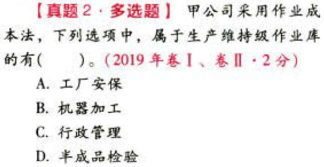

C15作业成本法

# 1. 题目

【答案】
[查看解析和答案](media/4c06b0b71a71668bac4504ae16aabcfa.png.md)
# 2. 题目

【答案】
[查看解析和答案](media/91da5461f25289c1c5d99dede7d91bdb.png.md)
# 3. 题目

【答案】
[查看解析和答案](media/4acfe76209cf8ad6dd3294bd051fee25.png.md)
# 4. 题目

【答案】
[查看解析和答案](media/c5131b4e1873f6dae91fa09b64015e0f.png.md)
# 5. 题目

【答案】
[查看解析和答案](media/204d4ea0f2b4aab61e774b9c5e1fd5d9.png.md)
# 6. 题目

【答案】
[查看解析和答案](media/57dce675c7ee8cff911440ab0df3e3c5.png.md)
# 7. 题目

【答案】
[查看解析和答案](media/4a465aa35fa36b67c3e0eb8955e433c6.png.md)
# 8. 题目

【答案】
[查看解析和答案](media/e1fca022744b0bc751e921f23977d848.png.md)

