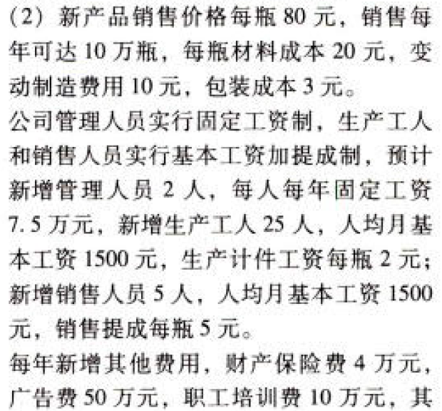

C16本量利分析

# 1. 题目

【答案】
[查看解析和答案](media/5fa19bf560ec0be2f7c0d0881df81906.png.md)
# 2. 题目

【答案】
[查看解析和答案](media/9e59562b086e353dc31d3a98d5f9bffc.png.md)
# 3. 题目

【答案】
[查看解析和答案](media/3af9f3422aac8263b11aea2e9be48940.png.md)
# 4. 题目

【答案】
[查看解析和答案](media/aa5a38a7a8f2368f23b3eb96183008ea.png.md)
# 5. 题目

【答案】
[查看解析和答案](media/b469b0c190677b173a410103aa3bf954.png.md)
# 6. 题目

【答案】
[查看解析和答案](media/2b99ec5973f6dd21c32a78db640bcb72.png.md)
# 7. 题目

【答案】
[查看解析和答案](media/0dbb59f2984eb52656b6f4129704fecc.png.md)
# 8. 题目

【答案】
[查看解析和答案](media/e0409a7c7253d50925f4fd702c8d3f70.png.md)
# 9. 题目

【答案】
[查看解析和答案](media/03914be355ad5da2f85c8fa7ce15ab73.png.md)
# 10. 题目

【答案】
[查看解析和答案](media/06293f7ee97e9e3c69c9c531450a525a.png.md)

